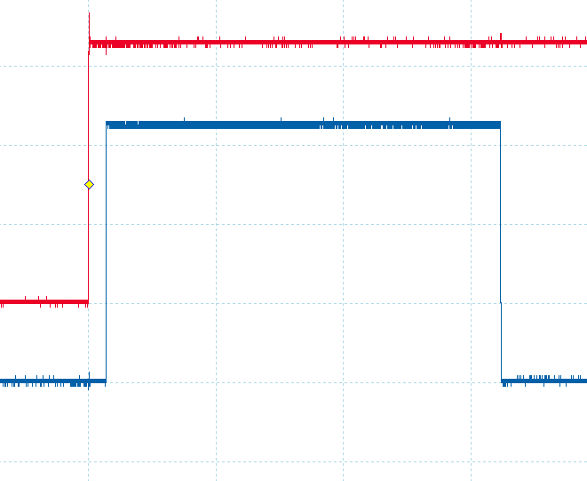
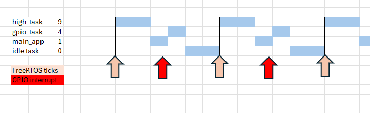
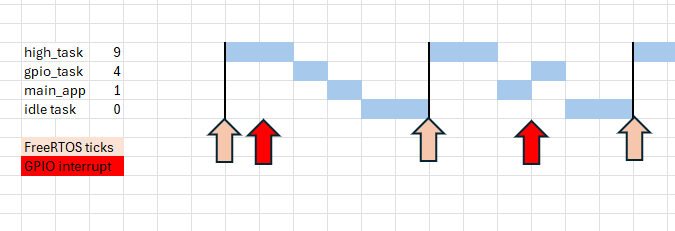

## 1. Overview

In this lab you will study two ESP32 applications and then merge those.

## 2 GPIO Interrupt and task latencies

You will measure how long time it takes from input event (rising or falling edge in gpio pin) to interrupt service start and to task level.

## 2.1 Initial setup

1. Create an instance of generic_gpio example
2. Study the code:
   - Familiarize with the general event flow in code: gpio signal edge --> interrupt handler --> queue message --> task handler
   - The code connects to 2 GPIO pins as inputs. Check the configuration to see which pins are connected. Connect wire between those as instructed in example code comments.
3. Configure a new GPIO pin as output. Set to level 1 as soon as possible in interrupt handler. Set it to zero at task level in task code, right after receiving the message from queue.
4. Connect oscilloscope to some input pin and your new output pin. Trigger to input event (red in example capture below, and then measure time delay from that to interrupt handler = blue rising edge, and to task handler = blue falling edge).
5. Report your results to file "latencies.txt" as

```
Latencies when ISR is triggered synchronously from main_app, initial version:
Interrupt latency = X us
Task latency = X us
```



### 2.2 Latencies with immediate context switch

By default, FreeRTOS interrupts return to interrupted context. If higher priority task is woken to ready state, it will wait until next context switch. In example code context this means that sending data message to queue in ISR triggers no immediate context switch, but main_app task runs until next vTaskDelay() call, where context switch to gpio_task takes place.

To get faster task response, have the ISR make a context switch to highest ready task context immediately at ISR return. Change the ISR code as follows

```c
static void IRAM_ATTR gpio_isr_handler(void* arg)
{
    uint32_t gpio_num = (uint32_t) arg;
    BaseType_t xHigherPriorityTaskWoken = pdFALSE;
    gpio_set_level(MYGPIO, 1);
    xQueueSendFromISR(gpio_evt_queue, &gpio_num, &xHigherPriorityTaskWoken);
    if (xHigherPriorityTaskWoken == pdTRUE) {
       portYIELD_FROM_ISR();
    }
}
```

Measure the latencies again and append to report

```
...
Latencies when ISR is triggered synchronously from main_app, version with ctx switch at ISR return:
Interrupt latency = X us
Task latency = X us
```

### 2.3 The effect of code-synchronous interrupts

This previous result is somewhat misleading. The app-main task has very low priority of value 1, only idle task has lower priority. So when timer tick occurs, all more important tasks will be run first, and only finally app_main can use the rest of time until next timer tick. In the setup the ISR occurs **synchronously to program code**: when app_main task is scheduled to run, it toggles GPIO pin causing an interrupt, that can be handled immediately by GPIO task at priority level 4. GPIO interrupts never occur during possible timer tick -triggered higher priority tasks:



To verify this behavior, add a higher priority task that wastes some time working (it need to do actual calculation work, using vTaskDelay() would just pass the CPU to lower priorities and then we do not see the expected effect).

The following task snippet spends about 0.5 ms in calculation. Create a task at priority 9 with this, and set gpio_task to priority 4 to make priorities same as in diagram above.

```c
volatile int a;
void doWorkTask(void* arg)
{
    for(;;) {
        for(int i=0; i<10000; i++)
            a=a+3;
        vTaskDelay(1);
    }
}
```

Verify that you still get perfect looking task response times, as if the gpio_task never needs to wait for higher priority tasks to complete.

By the way, how to know what tasks the system is running? You can use this snippet below in your code. **Note** that this requires enabling

```
configUSE_TRACE_FACILITY
configUSE_STATS_FORMATTING_FUNCTIONS
```

in menuconfig!

```c
void printTaskList(void)
{
    // Allocate a buffer to hold the task list data.
    // Make the buffer large enough for your expected number of tasks.
    char *taskListBuffer = malloc(1024);
    if (taskListBuffer == NULL) {
        printf("Failed to allocate memory for task list!");
        return;
    }
    // Generate the task list.
    vTaskList(taskListBuffer);
    // Print the task list to the serial monitor.
    printf("\nTask Name\tStatus\tPrio\tStack\tTask#\n%s", taskListBuffer);
    free(taskListBuffer);
}
```

Test that snippet in code too, to verify your tasks are running as expected with planned priorities.

### 2.4 RMT device as pulse generator

In a more presentative setup the interrupts occur asynchronously, so they can also take place when higher priority tasks are run: interrupt handler is activated immediately, but gpio task can process the message only after higher priority tasks are complete.

To create interrupt requests at random time points, i.e. not synchronously to program state, we'll use RMT device. RMT peripheral is originally intended for IR remote control applications. It allows you to define pulse sequences that can be accurately transmitted via gpio output pin **without any software supervision**. The pulse sequences can be repeated automatically.

In our application, we want to create digital pulses that occur independently of current software state. RMT device is perfect for that purpose (alternatively, we could use picoscope arbitrary waveform generation for that purpose as well).

For initial RMT testing, create another esp-idf project in lab folder:

1. Start with a simple application as baseline: create an instance of helloworld example in lab folder.
2. In main/CMakeLists.txt remove unnecessary `PRIV_REQUIRES spi_flash`
3. Copy the content of repo `morse.c` file over original hello_world_main.c contents
4. Study the code.
5. Perform `ESP-IDF: Run Idf.py reconfigure task`
6. Connect a LED to output GPIO pin
7. Build and run

You should see the morse code LED output. As you can see in example code, the morse codes are just defined for the RMT device, and then app_main thread just keeps idling in a loop. What you cannot easily see from the code, is that there are no interrupts involved and no DMA operations either. The blinking is run by hardware only.

### 2.5. Asynchronous ISR setup

Add RMT functionality to generic_gpio program, so that RMT sequence keeps running. Connect RMT output pin to interrupting GPIO input pin. Measure the latencies again.

You should now see higher task latencies, because the ISR can occur in the middle of work task, which will first run to completion before switch to priority can occur.



Append final results to file "latencies.txt" as

```
...

Latencies when ISR is triggered from RMT device:
Interrupt latency = X us
Task latency = X us
```
