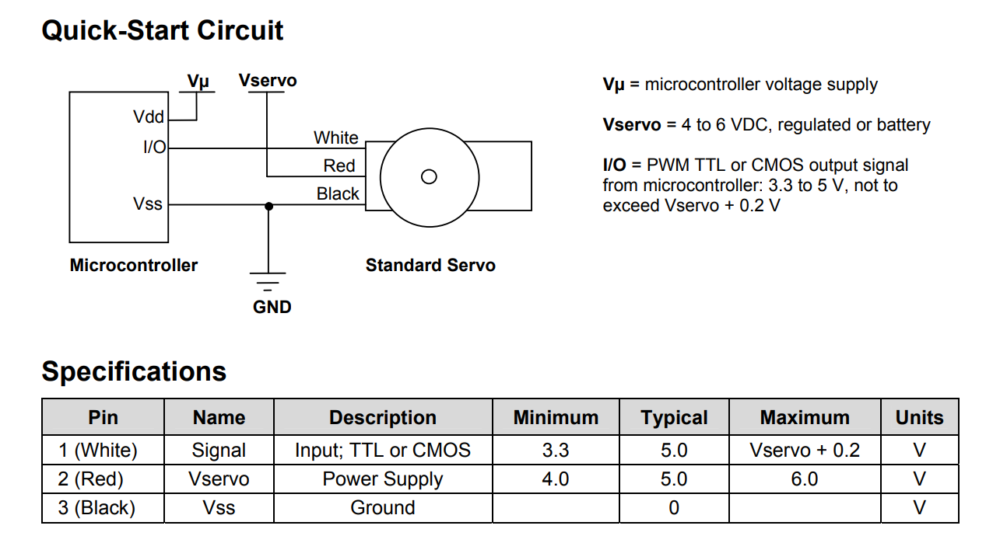
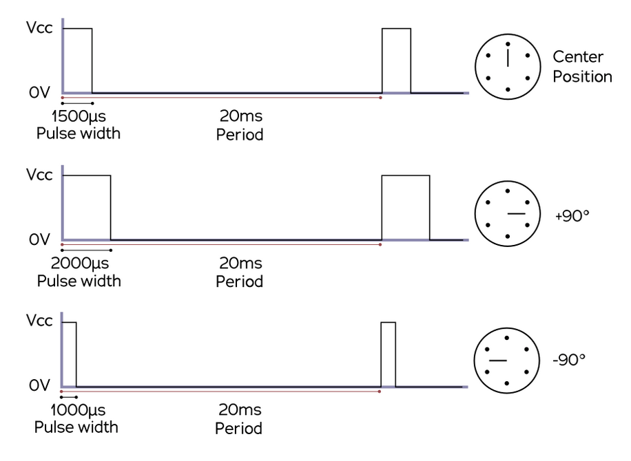
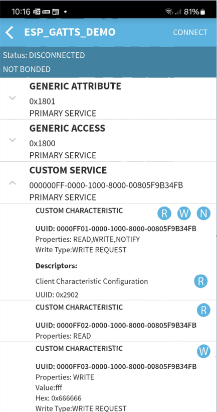
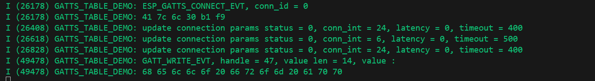

# Lab 5. Bluetooth Low Energy controlled servo motor

In this lab you will

1. connect a servo motor to ESP (using ESP example code), then
2. extract servo functionality to a c module (to files servo.c and servo.h), and
3. study bluetooth GATT server example
4. integrate servo to BLE example

## 5.1 Servo motor example

Create a sample project mcpwm_servo_control into repo folder lab7. Connect parallax standard servo to ESP32. Servo needs 5 volts for supply, and normal ESP32 GPIO output of 3.3 volts is good for control signal.


the example code should be plug and play. It initializes a hardware timer to produce output pulses of 1.5 +/- 0.5 milliseconds every 20 milliseconds.


Build, flash and monitor. The servo should be stepping back and forth in 2 degree steps.

## 5.2 Extract servo functionality to a C module

Modify the example so that everything related to servos is in servo.c, with function interface specified in servo.h:

```c
void init_servo(void);
void set_angle(int angle);
```

These two functions need to share one variable `comparator` so make it module static so that it is visible to both:

```c
static mcpwm_cmpr_handle_t comparator = NULL;
```

It is good practice to have separate tag for the module in logs, so define TAG for servo part as in snippets below.

```c
#include "esp_log.h"
...
static const char *TAG = "servo_module";

ESP_LOGI(TAG, "Create timer ...
```

Verify that your servo example code compiles and runs after refactoring as before.

## 5.3 BLE example

### 5.3.1 Initial test

Start with creating a copy of "gatt_server_service_table" project to lab8 repo. Now as there are other students working on same lab, you dont want to have multiple BLE devices advertising with same name. The default advertising name is "ESP_GATTS_DEMO", so change that in `raw_adv_data` array. Note that if you change the number of characters, you need to adjust the field length byte (originally 0x0F = 15, because 14 characters + field type `ESP_BLE_AD_TYPE_NAME_CMPL`)

The example should run as it is, so build, flash and monitor. ESP32 starts advertising. Use Android app "BLE scanner" or similar to connect to the device.



In "CUSTOM SERVICE" write to third custom characteristic (by clicking the blue W in this app). Write some some value and see it triggering text in vscode terminal



### 5.3.2 Anatomy of BLE app

The ble server example is a bit more complicated than what we actually need, because this one example demonstrates connection events (GAP level) and all possible attribute level (GATT) things like read, write and notifications. We only need writes to a BLE service characteristic.

There is more complexity hidden. When the application starts, the system has already started a number of BLE stack tasks, and those we dont see in source code. Lets have a closer look.

At the end of app_main add this snippet to print out all tasks in the system (this requires menuconfig settings for configUSE_TRACE_FACILITY and configUSE_STATS_FORMATTING_FUNCTIONS ).

```
    char *task_list_buffer = pvPortMalloc(1024);  // Allocate memory for task list
    if (task_list_buffer) {
        vTaskList(task_list_buffer);  // Generate the task list
        ESP_LOGI("TASK_LIST", "\nTask Name       State  Prio  Stack  Task ID\n%s", task_list_buffer);
        vPortFree(task_list_buffer);  // Free the memory
    }
```

Build, flash, monitor. How many tasks there are in the system and what are their priorities?  
In general, when there are any tasks with real-time requirements (BLE stack, WiFi stack, etc) our app should not do anything at or above those priority levels, otherwise we might mess up the intended task response times. **Application should always use lower priorities than the protocol stack tasks.**

In order to get the BLE written characteristic value, you need to hook into the place where "GATT_WRITE_EVT" is printed out. Locate that code part. Next question is: In which task context is that callback function called in? It is very likely that event callback happens in BLE stack task context, so you should not spend any extra time in that task (so **you need to send the important information to lower priority application task and handle the event there**).

Lets confirm that assumption with adding this snippet to callback function

```
// Get the handle of the current task
TaskHandle_t current_task_handle = xTaskGetCurrentTaskHandle();
// Get the name of the current task
const char *task_name = pcTaskGetName(current_task_handle);
ESP_LOGI("TASK_INFO", "Current task: %s", task_name);
```

What task and priority the callback is running at GATT_WRITE_EVT printing?

## 5.3 Integrate to servo

1. Add servo.c and servo.h to the BLE project.
2. Initialize servo at start of app_main
3. Create a Queue to communicate BLE write events from BLE stack level callback to app_main task. You find necessary snippets in generic_gpio example, with the difference that sending data from task level you use `xQueueSend()` function, not the ISR version.
4. In ble event callback, parse the ASCII text message into a int variable, and pass that to queue.
5. At the end of app_main, in forever loop pend for queue data and call set_angle with that.

Demonstrate the working demo to teacher.
