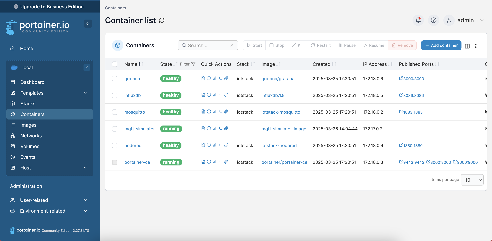
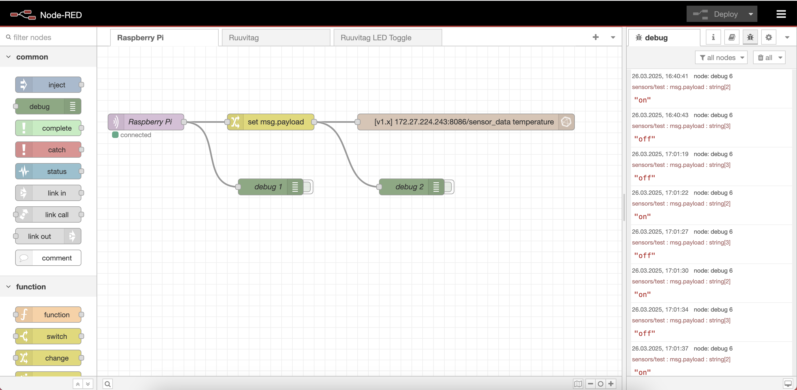
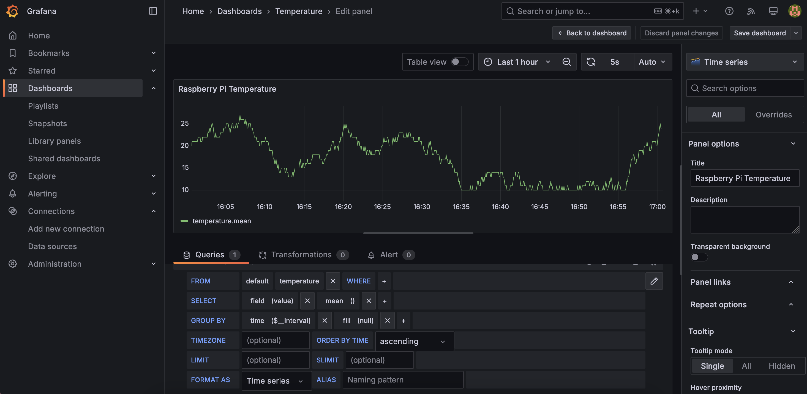
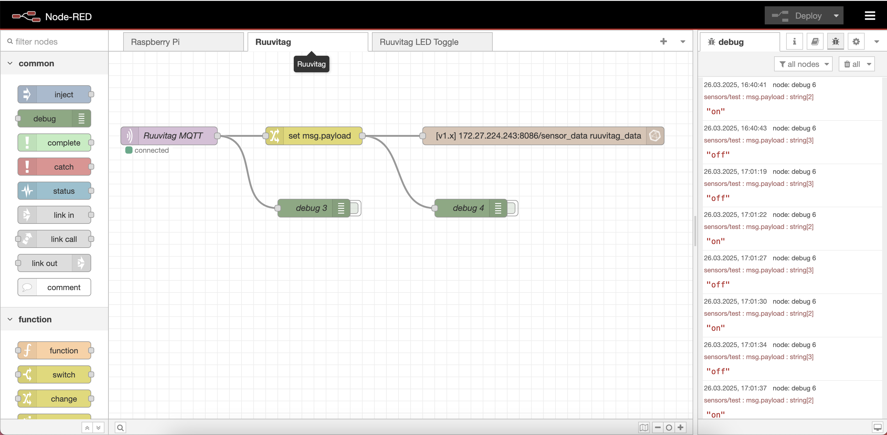
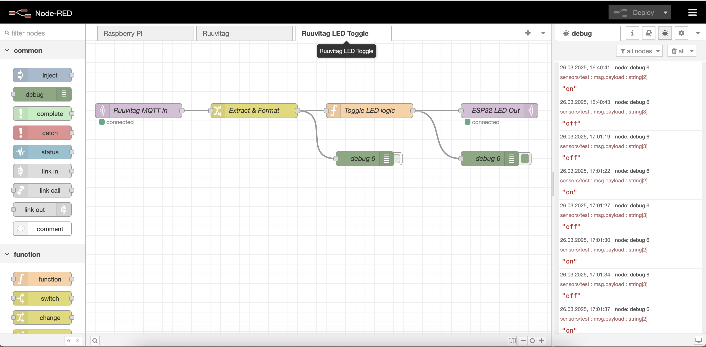
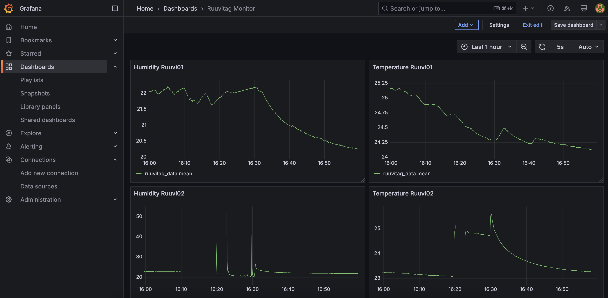

# Lab 7: IoT Stack Integration

## Project Overview

In **Lab 7**, I developed a complete **Docker-based IoT data pipeline** that integrates environmental sensors with cloud-native tools. The system collects data from **RuuviTag** sensors over Bluetooth, publishes it via **MQTT**, processes and routes it in **Node-RED**, stores it in **InfluxDB**, and visualizes it using **Grafana**. An **ESP32** device listens to MQTT commands and toggles its LED based on Z-axis orientation.

The stack is deployed on a **Raspberry Pi** using Docker and managed via **IOTstack** and **Portainer-CE**.

## Key Features

- Integrates **Mosquitto**, **Node-RED**, **InfluxDB**, **Grafana**, and **Portainer** using Docker
- Uses **RuuviTag** and a custom Python script to publish Bluetooth sensor data via MQTT
- Node-RED processes and filters incoming sensor data and writes to InfluxDB
- Sends MQTT LED toggle commands based on Z-axis orientation
- ESP32 receives `"on"`/`"off"` messages and toggles its onboard LED
- Built with **ESP-IDF** for the embedded firmware

## Task Description

The task description can be found in the [task-description.md](task-description.md) file.

## Solution

The solution consists of two main components: a Docker-based IoT stack running on a Raspberry Pi, and an ESP32 firmware project for LED control.

### Docker IoT Stack (Raspberry Pi)

- `listen-ruuvitags.py`: Python script that listens for RuuviTag BLE advertisements and publishes parsed data to MQTT
- `node-red-flow.json`: Node-RED flow to:
  - Filter and format sensor data
  - Detect Z-axis orientation changes
  - Store data in InfluxDB
  - Publish control messages to ESP32
- Docker containers:
  - `mosquitto` — MQTT broker
  - `node-red` — no-code logic editor
  - `influxdb` — time-series database
  - `grafana` — visualization dashboard
  - `portainer-ce` — Docker UI

### ESP32 Firmware (`ruuvitag_led_toggle/`)

- `main/app_main.c`: Connects to Wi-Fi and MQTT, listens on `esp32/led`, toggles LED based on messages
- `CMakeLists.txt`: Project configuration

## How to Build and Run

1. Set up the ESP-IDF environment:

   ```sh
   . $HOME/esp/esp-idf/export.sh
   ```

2. Build and flash the ESP32 project:

   ```sh
   cd ruuvitag_led_toggle
   idf.py build
   idf.py flash
   idf.py monitor
   ```

3. On Raspberry Pi, start Docker containers (e.g., via IOTstack or `docker-compose`)

4. Run the RuuviTag listener script:

   ```sh
   python3 listen-ruuvitags.py
   ```

5. Open Node-RED, import `node-red-flow.json`, and deploy the flow

6. View live data in Grafana and test LED control via Z-axis orientation

## MQTT Topics Used

- `sensors/test` — published by Python script with RuuviTag data
- `esp32/led` — consumed by ESP32 to toggle the LED

## Screenshots

### Portainer-CE: Running containers



### Node-RED: Simulated temperature flow



### Grafana: Simulated temperature data



### Node-RED: RuuviTag logic and LED control



### Node-RED: Toggle logic



### Grafana: RuuviTag sensor dashboard



## Included Files

- `listen-ruuvitags.py` — Python script to read and forward RuuviTag data
- `node-red-flow.json` — Node-RED flow export
