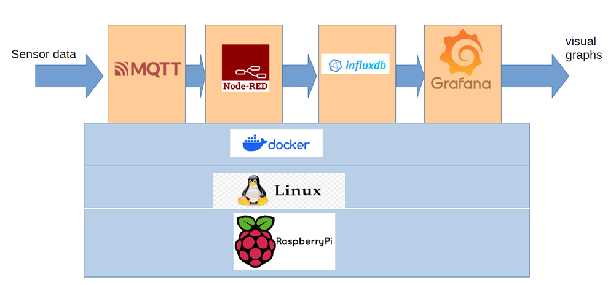
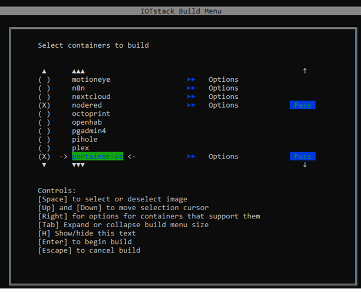
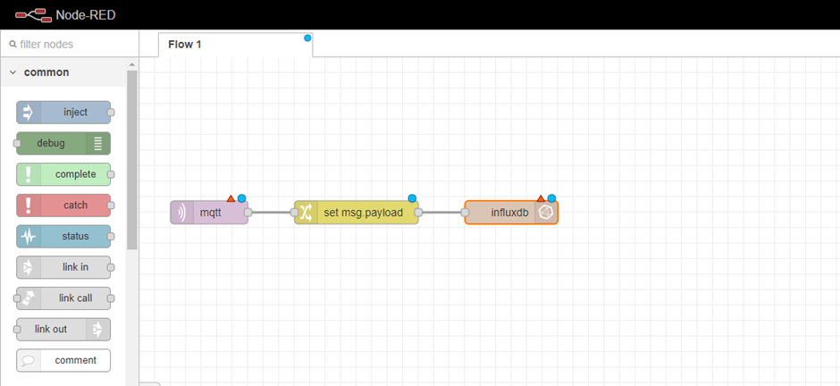

# 7. Introduction

In this laboratory exercise you will create a complete IoT solution for collecting sensor data and storing it to a database, and finally visualizing the data.



In this lab you will install and run docker containers that provide the necessary services:  
·       **Mqtt broker** is a publish-subscribe message bus which is typical solution in IoT systems. Sensors publish mqtt messages and those messages can be then received by data consumers, by subscribing to a message topic.  
·       **Node-RED** is a no-code solution for message processing and system logic, allowing for example triggering alarms at specified sensor reading levels.  
·       **Infludb** is a database optimized for time series data (time stamped value sequence), for example sensor data.  
·       **Grafana** is a web server that provides visualizations of data. In this setup it gets the simulated temperature data from influx database and draws a time graph.

> Docker containers are lightweight, standalone packages that contain everything needed to run a specific software, including the code, runtime, system tools, libraries, and settings. They are isolated from each other and the host system, ensuring that software runs consistently across different computing environments. Docker containers are created from images that specify their precise contents, and they can be easily shared, deployed, and scaled, making them popular for streamlining the development, testing, and deployment processes of applications.

## 7.1 Initial Setp

## 7.1.1 Installing IoT Stack

Iot stack is a framework that makes it easy to configure a composition of multiple docker containers. The IoTstack configuration menu essentially generates a docker-compose.yml setup file for selected containers (this file could be created and edited manually)

a)    Download and install IOTstack using the command

```code
curl -fsSL https://raw.githubusercontent.com/SensorsIot/IOTstack/master/install.sh | bash
```

b)     Once Raspberry Pi has rebooted, navigate into /IOTstack folder and open stack configuration menu with

**./menu**  
and continue to `->Build stack<-`

c)    In the menu select the following components:  
**Grafana**, **InfluxDB**, **Mosquitto**, **Node-RED** and **Portainer-CE**:  
·       Menu response is not fast, so **do not keep arrow button pressed**: it will not go faster, but only fills the keypress buffer so you will need to wait until buffer is empty before next presses.  
·       When you select Node-RED component you will get error ‘**’addons_list.yml does not exist**’’. For the NodeRed options choose ‘**’Select & build addon list**’’. Just accept the preselected addons and go back to previous menu.  
·       When all the components **Grafana**, **InfluxDB**, **Mosquitto**, **Node-RED** and **Portainer-CE** are selected, press **Enter** to build the docker-compose.yml file.



## 7.1.2 Starting up the IoT Stack

a)   Now that we have the docker-compose.yml file we can just start the stack from command line, and check all is running ok

```code
docker-compose up -d
docker-compose ps
```


## 7.1.3 Create the InfluxDB database

a)    Get command line access to influx docker container with command

```
docker exec -it influxdb influx
```

b)    In the Influx docker container, type:

```
CREATE DATABASE sensor_data
```

c) `quit` to exit the docker container.

> The steps above serve as an example how to get cli access to a running container. Note that containers restart from the image state, so if you add packages or files into container, those will disappear when you restart the container. Adding files and packages permanently needs to be done within `Dockerfile` or `docker-compose.yml` files

## 7.1.4 Run the MQTT Simulator container

a)   On terminal, navigate back to home folder and clone mqtt simulator repository

```
git clone https://github.com/DamascenoRafael/mqtt-simulator
```

b)    Edit the simulator configuration with **nano config/settings.json** command, and replace the contents of the file with the text provided here **and update the ip field to your actual raspi id**.

```
{
    "BROKER_URL": "your-raspi-ip",
    "BROKER_PORT": 1883,
    "TOPICS": [
        {
            "TYPE": "single",
            "PREFIX": "-----",
            "TIME_INTERVAL": 5,
            "DATA": [
                {
                    "NAME": "temperature",
                    "TYPE": "int",
                    "MIN_VALUE": 10,
                    "MAX_VALUE": 40,
                    "MAX_STEP": 1,
                    "RETAIN_PROBABILITY": 0.1,
                    "INCREASE_PROBABILITY": 0.5
                }
            ]
        }
    ]
}
```

c)    Build the mqtt-simulator image

```
docker build -t mqtt-simulator-image .
```

The trailing dot indicates the necessary Dockerfile for the image is in current folder.

d)      To start the container, run in the terminal

```
docker run -d --name mqtt-simulator mqtt-simulator-image
```

to start the mqtt-simulator docker container. To check that simulator configuration is OK and simulator is running type

```
docker ps
```

that shows all running containers including mqtt-simulator:


**Troubleshooting**: If you do not see mqtt-simulator in that list, see docker logs for that failed container (get your container id like 02a5ca33da0de1d3082bca172c4d1ae2ecf773483e98c7e052252af1113ded7c from “docker run” response in earlier step):  
**docker logs [your-container-id]**

and find the error (most likely in the settings.json file). After editing the settings.json, you need to

1.     delete the failed container with  
**docker rm [old-container-id]**

2.     rebuild the new fixed container (exactly as above, repeated here)  
**docker build -t mqtt-simulator-image .**

3.     start the new fixed container (exactly as above, repeated here)  
**docker run -d --name mqtt-simulator mqtt-simulator-image**

## 7.1.5 Setting up Node-RED

a)    In web browser go to **http://[your-localhost-ip]:1880**

b)     This will open Node-Red configuration page. Close the welcome message. On the left side there is a set nodes.  
Add nodes **mqtt in**, **change** and **influxdb out** to the chart, and connect them.


c)    Configure **mqtt in** with your actual raspi ip, to subscribe to topic you configured in the simulator.

d)    To check that your mqtt in node works ok and is correctly connected to mqtt-simulator that you set up already,

1.     Add a debug node in node-red flow and wire it to mqtt node output,  
2.     Deploy the changes (red button on top-right)  
3.     Choose debug tab on right pane as shown below  
4.     Verify there is new data coming in every 5 seconds (if not, check the previous setup steps)


e)   Configure the **change** node to reformat payload for influxdb. Use **expression** as below

```code
{
     "temperature": msg.payload.temperature
}

```

f)      Configure **influxdb out** node with your server (raspi) ip, database name and measurements name as you configured those when creating the database.

Type **sensor_data** in the Measurement field and click the red Done button.

## 7.1.6 Setting up Grafana

Now we will connect Grafana visualization platform to our database.

a)    In web browser go to **http://your-raspi-ip:3000**. This will open the Grafana dashboard. It will ask for credentials just use username/password **admin/admin**

b)    Now click the ‘’DATA SOURCES’’ tab to add a data source.

Select InfluxDB.

Under HTTP type in the URL field **http://your-raspi-ip:8086**.

Under InfluxDB Details type in the Database field **sensor_data**, from HTTP Method dropdown menu select **GET** .

The click the blue Save & test button you should see a green bar and message saying the datasource is working.

c)     Next you will create a dashboard. Navigate to the upper left corner and click the button with the three vertical lines. From the dropdown menu select Dashboards.

## 7.1.7 Check data flow

To verify there is now simulated data flowing from simulator to nodered and to influx database, lets check do we see the new data in influxdb:  
Use  
**docker exec -it influxdb influx**command to get inside InfluxDB docker container terminal. Then use **USE sensor_data** command, use **show measurements** command and **select \* from sensor_data** commands respectively and there should be some data in the database.

Use **quit** command to exit the InfluxDB container terminal.

In grafana GUI view click **+ Create Dashboard** and then add a new visualization. In **Select data source** tab select **InfluxDB**.

At the bottom of the page there is the options. Click the **select measurement** and choose **sensor_data**, click **field(value)** and select **temperature**.

You should then start seeing the data on dashboard.

# 7.2 Getting physical sensor data to the stack

The inbuilt problem with containers (for embedded designers) is that containers are very well isolated from the platform. This of course allows easy portability, cloning, server farms and stuff, but if you want to get access to hardware that is not easy. To keep things easy, your containers should only communicate via tcp/ip ports. If you need access to hardware, you run that part of code on the platform or host os, and send data via mqtt or rest api to containers.

Next you will demonstrate getting Ruuvitag data to your IoT stack. Ruuvitag is a Bluetooth LE device sending temperature etc information. Install the necessary python libararies for it into raspi https://pypi.org/project/ruuvitag-sensor/

The example python code in this lab needs mqtt broker ip and mqtt topic as parameters, like in below (replace ip with your raspi ip)

```
python ruuvitag-listen.py -b 10.99.40.186 -t sensors/test
```

The code should produce mqtt messages with this format

```
{
  "mac": "E0:75:5D:F3:C3:C7",
  "data_data_format": 5,
  "data_humidity": 30.02,
  "data_temperature": 18.02,
  "data_acceleration": 1022.7648801166375,
  "data_acceleration_x": 52,
  "data_acceleration_y": 288,
  "data_acceleration_z": 980,
  "data_tx_power": 4,
  "data_battery": 2939,
  "data_movement_counter": 248,
  "data_measurement_sequence_number": 11630,
  "data_mac": "e0755df3c3c7",
  "data_rssi": -60
}
```

In change block you need to reformat that into this for influxdb:

```
[{
  "humidity": 30.02,
  "temperature": 18.02,
  "acceleration": 1022.7648801166375,
  "acceleration_x": 52,
  "acceleration_y": 288,
  "acceleration_z": 980,
  "tx_power": 4,
  "battery": 2939,
  "movement_counter": 248,
  "measurement_sequence_number": 11630,
  "rssi": -60
},
{
  "tag1": "E0:75:5D:F3:C3:C7",
  "tag2": "e0755df3c3c7"
}]
```

Using tags allow selecting data from single sensor only for a graph (otherwise all temperatures from all sensors appear in same graph).

# 7.3 Adding actions

Next, create a system that keeps listening data from a ruuvitag, and in node-red it shall detect z-acceleration changes and turn on/off a led on ESP32 accordingly (via mqtt). In other words, turning the ruuvitag upside down shall toggle led state. To send MQTT commands to ESP32, you can use the eclipseproject mqtt broker as you did in previous lab.

This you shall implement using the ruuvitag python code above, and your ESP32 mqtt client controlling a led.
Hint: the easiest path is to use test.mosquitto.org broker, and connect ESP32 to that via lab wifi.
