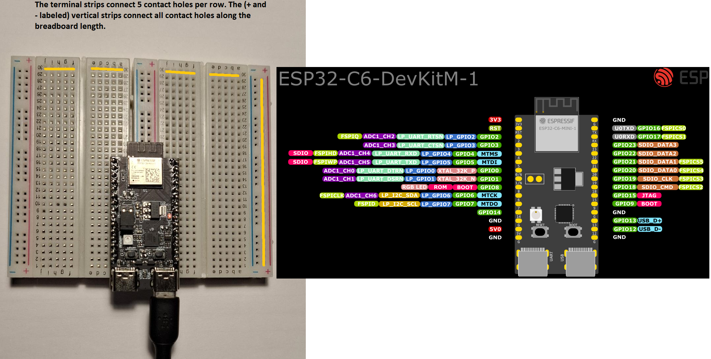
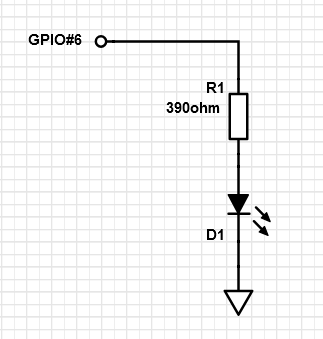
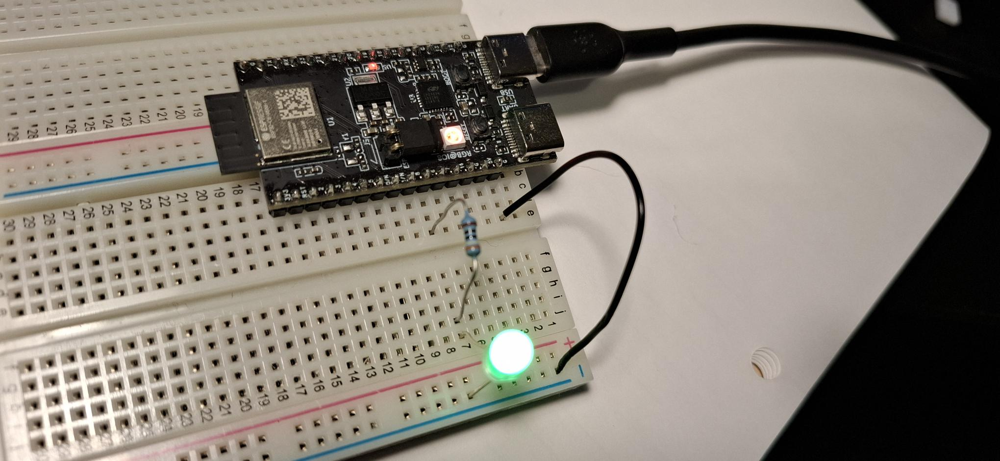
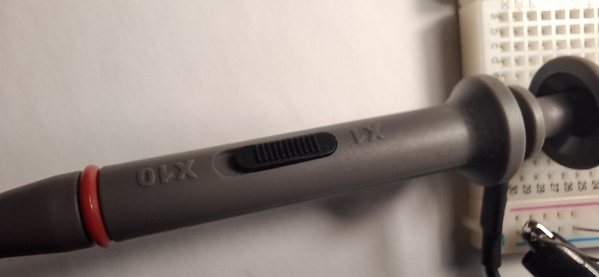
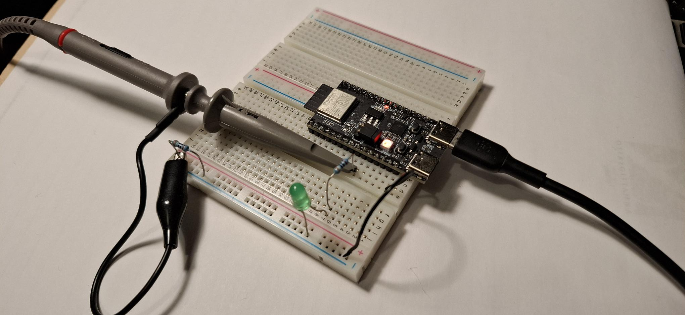
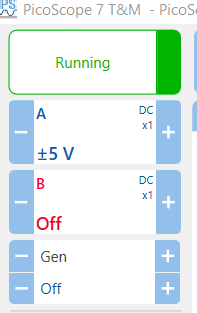
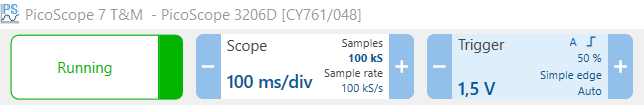
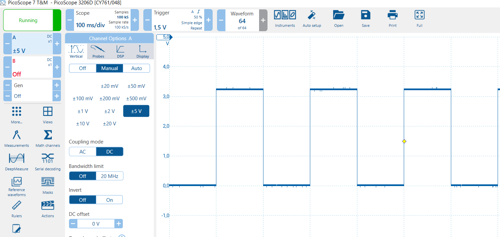

# Lab 1 Hardware Tools

## 1.1 Breadboard

Rules for breadboard connections:

- **Be extremely careful** with voltage (5V / 3.3V) and ground (G) lines. Short circuiting these lines to other circuit parts can cause permanent damage!
  - Good practice is to disconnect USB cable when making or changing connections
- **Terminal strip** is a metal part connecting the holes of the breadboard. The orange lines in picture below show how horizontal hole rows are connected together in groups of 5. The + and- labeled columns are connected for the whole length of the breadboard.
  - Good practice especially for larger circuits is to have supply rails (i.e. positive voltage and ground) connected to vertical strips.
- Pick standard wire colors for supplies: **+3.3V = red, GND = black**. This makes checking the circuits much easier.
- **Note that photos below are from DevKit-C setup, you are using DevKit-M. Different pinouts!**

Example circuit:

**Note** selecting ground strip for GND, and using black wire to connect.

How to know I connected the LED right way (LED is a diode that works only one way)?

- Check visually: cathode is much larger inside and has cut on round edge, or
- Check electrically: move the resistor end from ESP GPIO port to 3.3V supply. It should light regardless of your software state
  - This is example of good debugging practice: Always first try to determine whether it is your hardware circuit or software operation that is faulty

## 1.2 Build circuit

1. Create yet another instance of blink into lab1 folder
2. Configure it to use GPIO port.
3. Disconnect USB, build the circuit as above and connect USB.
4. Build, Flash and Monitor

## 1.3 Using oscilloscope

1. Get a picoscope
2. Check the model number, and [download](https://www.picotech.com/downloads) applicable software for your laptop
3. Connect picoscope USB cable to laptop
4. Install and run picoscope sw
   - depending on the order of oeprations, it might be that picoscope sw runs a demo simulator. Choose the physical picoscope device.
5. Blink example: configure blink rate of 100ms and rebuild.
6. Check probe attenuation. The probe has a slider switch. X1 has no attenuation, so you should see all volages in oscilloscope traces as they are. Make sure you have X1 set.  
   

7. Connect picoscope probe to circuit
   - **Carefully** connect probe ground clip to your circuit ground. **Make sure it cannot move and touch other components nearby causing a short circuit!!!**
     - You can add dummy component to ground rail (both wires in ground, so it really doesn't matter what component it is). See image below.
   - Connect probe to ESP GPIO port (resistor wire is good for this). Again, make sure the probe doesn't pull the components so that short circuits could happen.

Example:

8. The picoscope acquisition settings must be right to see anything properly. Start with channel selections on top left (A channel probe connected to ESP board with +-5 volt scale, B channel unused, generator function off). You can open settings for each clicking on these boxes on display.

8. Set time axis and triggering on top row boxes
   - We just set the output rate to 100ms, so the same setting 100ms/div is good for us (div i.e. division means one unit on horizontal display grid).
   - Open trigger menu by clicking the trigger box on left top:
     - Trigger mode "Repeat" works well here: it repeatedly waits for the trigger condition to be true, and redraws the display after each trigger. "Auto" mode slightly better for debugging: if trigger is missing, then it draws the signal display anyways after small timeout, so you can see if the signal is completely missing or you set trigger conditions better.
     - Trigger type "simple edge" is fine.
     - Trigger source must be the channel that is connected to ESP board.
     - Trigger threshold is typically set to midpoint of signal range --> 1.5v is good.
     - Rising edge is good.
     - 50% pre-trigger shows the trace before and after the trigger., it is OK.  
       

## 1.4 Assignment

Return a text file lab1/measurements.txt with this information

1. What was the pulse high state voltage you measured?
2. What is the frequency of the output pulses?
